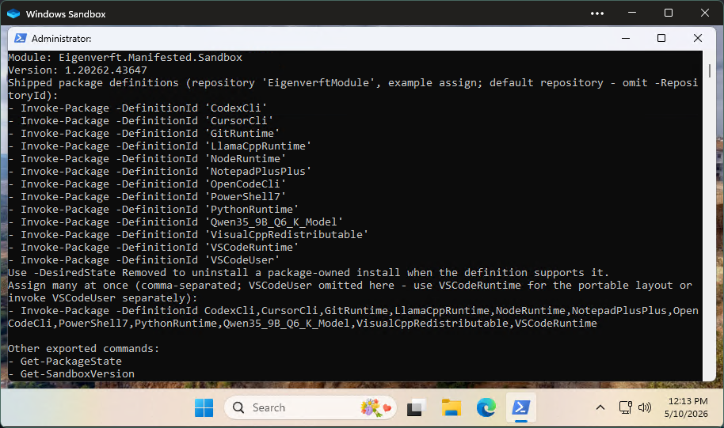

# Eigenverft.Manifested.Sandbox

[](https://www.powershellgallery.com/packages/Eigenverft.Manifested.Sandbox) [](https://www.powershellgallery.com/packages/Eigenverft.Manifested.Sandbox) [](src/prj/Eigenverft.Manifested.Sandbox/Eigenverft.Manifested.Sandbox.psd1) [](https://github.com/eigenverft/Eigenverft.Manifested.Sandbox/actions/workflows/cicd.yml) [](LICENSE)

Windows-focused PowerShell module and bootstrap flow for quickly turning a fresh Windows Sandbox session into a usable development environment, especially from a `.wsb` startup entrypoint. It can provision managed Python, PowerShell 7, Node.js, OpenCode CLI, Gemini CLI, Qwen CLI, Codex CLI, GitHub CLI, MinGit, VS Code, and Microsoft Visual C++ runtime prerequisites when you want them.

The primary intent is fast, repeatable setup inside Windows Sandbox. The same bootstrap pattern can also run on a normal Windows machine, but that is a secondary use case rather than the main focus of this repo.

🚀 **Key Features:**
- Fast Windows Sandbox bring-up from a `.wsb` startup command or a manual shell
- Managed runtime provisioning for `python`, `pip`, `pwsh`, `git`, `gh`, `code`, `node`, `npm`, `opencode`, `gemini`, `qwen`, `codex`, and VC++ prerequisites
- Runtime discovery that can reuse compatible external installs or refresh to sandbox-owned managed copies
- Persisted command results plus live runtime snapshots through `Get-SandboxState`
- Managed npm ownership under the sandbox Node runtime, including proxy-aware npm configuration when Windows resolves the npm registry through a proxy
- Reusable `iwr | iex` bootstrap flow for repo-specific or generic PowerShell handoff scenarios
- PowerShell 5.1-first bootstrap path with normal Windows machine support as a secondary workflow

## 📌 Current State

The module currently exports these public commands:

- `Get-SandboxVersion`
- `Get-SandboxState`
- `Initialize-PythonRuntime`
- `Initialize-Ps7Runtime`
- `Initialize-GitRuntime`
- `Initialize-VSCodeRuntime`
- `Initialize-NodeRuntime`
- `Initialize-OpenCodeRuntime`
- `Initialize-GeminiRuntime`
- `Initialize-QwenRuntime`
- `Initialize-CodexRuntime`
- `Initialize-GHCliRuntime`
- `Initialize-VCRuntime`

There is not yet a single combined `Initialize-Sandbox` command. The current model is a set of small init commands that each read real state, plan from that state, perform bounded repair or install work, and persist the observed result.

---

## 🧭 Motivation

Windows Sandbox is ideal for disposable setup checks: bootstrap a repo, validate installer behavior, and test fresh-machine assumptions without touching your main workstation.

The problem is that a blank `.wsb` session still takes manual work to become useful. This project turns that repeated setup into a small versioned PowerShell entrypoint so the environment is quick to reuse instead of tedious to rebuild.

## 🖥️ Host Requirements

Windows Sandbox on the host requires Windows 10/11 `1903+`, Pro/Enterprise/Education/Pro Education/SE, virtualization enabled, 4 GB RAM, 1 GB free disk, 2 CPU cores, and the `Windows Sandbox` feature enabled.

## 🖼️ Preview



Example Windows Sandbox session after the bootstrapper opens PowerShell and the follow-up runtime commands are available.

---

## 📥 Bootstrapper

The bootstrapper is optimized for getting a Windows Sandbox session ready quickly. It installs the required PowerShell package tooling plus `Eigenverft.Manifested.Sandbox` from the PowerShell Gallery, then opens a new Windows PowerShell console and runs the default follow-up command.

> 💡 Even if you do not end up using this module's managed runtime installers, the bootstrapper is still useful as a reusable startup pattern. It gives you a simple way to install a chosen set of PowerShell Gallery modules, open a fresh console, and immediately run a preset command chain.

PowerShell Gallery package: [Eigenverft.Manifested.Sandbox](https://www.powershellgallery.com/packages/Eigenverft.Manifested.Sandbox)

### 🔐 Trust / Install Notes

The published bootstrap one-liner first downloads [`iwr/bootstrapper.ps1`](https://raw.githubusercontent.com/eigenverft/Eigenverft.Manifested.Sandbox/refs/heads/main/iwr/bootstrapper.ps1) from `raw.githubusercontent.com` and then, in Windows PowerShell 5.1:

- Enables TLS 1.2 if possible
- Tries to set the current user's execution policy to `Unrestricted`
- Bootstraps the `NuGet` package provider in `CurrentUser` scope
- Trusts or registers `PSGallery`
- Installs `PackageManagement`, `PowerShellGet`, and `Eigenverft.Manifested.Sandbox` in `CurrentUser` scope
- Opens a new Windows PowerShell session and runs `Get-SandboxVersion`

Admin rights are not required for the bootstrap or module install path. Later runtime actions can have different requirements; for example, `Initialize-VCRuntime` may still require elevation when the VC++ runtime needs to be installed or repaired.

### ▶️ Run It

> 💡 **Why is this command so long?** It includes a built-in proxy handshake. In heavily managed corporate environments, basic downloads often fail. This one-liner explicitly checks for and dynamically authenticates through your system's proxy with default network credentials before downloading the bootstrap script.

From Windows PowerShell 5.1:

```powershell
$u='https://raw.githubusercontent.com/eigenverft/Eigenverft.Manifested.Sandbox/refs/heads/main/iwr/bootstrapper.ps1';try{[Net.ServicePointManager]::SecurityProtocol=[Net.SecurityProtocolType]::Tls12}catch{};$p=[System.Net.WebRequest]::GetSystemWebProxy();if(-not $p.IsBypassed($u)){iwr $u -Proxy ($p.GetProxy($u).AbsoluteUri) -ProxyUseDefaultCredentials -UseBasicParsing|iex}else{iwr $u -UseBasicParsing|iex}
```

From `cmd.exe`:

```bat
powershell.exe -NoProfile -ExecutionPolicy Bypass -Command "$u='https://raw.githubusercontent.com/eigenverft/Eigenverft.Manifested.Sandbox/refs/heads/main/iwr/bootstrapper.ps1';try{[Net.ServicePointManager]::SecurityProtocol=[Net.SecurityProtocolType]::Tls12}catch{};$p=[System.Net.WebRequest]::GetSystemWebProxy();if(-not $p.IsBypassed($u)){iwr $u -Proxy ($p.GetProxy($u).AbsoluteUri) -ProxyUseDefaultCredentials -UseBasicParsing|iex}else{iwr $u -UseBasicParsing|iex}" && exit
```

### ⚠️ Skip Certificate Validation Variant

If your Windows PowerShell 5.1 environment is behind TLS interception or has an unusable enterprise trust chain, there is also an explicitly insecure bootstrapper variant that bypasses TLS certificate validation for both the initial download and the PSGallery bootstrap/install flow.

```powershell
$u='https://raw.githubusercontent.com/eigenverft/Eigenverft.Manifested.Sandbox/refs/heads/main/iwr/bootstrapper.skipcert.ps1';try{[Net.ServicePointManager]::SecurityProtocol=[Net.SecurityProtocolType]::Tls12}catch{};try{[System.Net.ServicePointManager]::ServerCertificateValidationCallback={$true}}catch{};$p=[System.Net.WebRequest]::GetSystemWebProxy();if(-not $p.IsBypassed($u)){iwr $u -Proxy ($p.GetProxy($u).AbsoluteUri) -ProxyUseDefaultCredentials -UseBasicParsing|iex}else{iwr $u -UseBasicParsing|iex}
```

### 🧰 Generic Bootstrap Variant

A generic version of the bootstrapper lets you specify which PowerShell Gallery modules to install and which command to invoke automatically, so it can be reused for projects beyond `Eigenverft.Manifested.Sandbox` and for repo-specific bootstrap flows that just need a clean handoff into PowerShell.

```powershell
$c='Initialize-VCRuntime;Initialize-PythonRuntime;Initialize-Ps7Runtime;Initialize-GitRuntime;Initialize-GHCliRuntime;Initialize-VSCodeRuntime;Initialize-NodeRuntime;Initialize-OpenCodeRuntime;Initialize-CodexRuntime;Get-SandboxState';$i='PackageManagement','PowerShellGet','Eigenverft.Manifested.Sandbox';$u='https://raw.githubusercontent.com/eigenverft/Eigenverft.Manifested.Sandbox/refs/heads/main/iwr/bootstrapper.sandbox.generic.ps1';try{[Net.ServicePointManager]::SecurityProtocol=[Net.SecurityProtocolType]::Tls12}catch{};$p=[System.Net.WebRequest]::GetSystemWebProxy();if(-not $p.IsBypassed($u)){iwr $u -Proxy ($p.GetProxy($u).AbsoluteUri) -ProxyUseDefaultCredentials -UseBasicParsing|iex}else{iwr $u -UseBasicParsing|iex}
```

If that same generic flow needs to run in a Windows PowerShell 5.1 environment with TLS interception or an unusable trust chain, swap the URL to the explicitly insecure generic skip-cert variant:

```powershell
$c='Initialize-VCRuntime;Initialize-PythonRuntime;Initialize-Ps7Runtime;Initialize-GitRuntime;Initialize-GHCliRuntime;Initialize-VSCodeRuntime;Initialize-NodeRuntime;Initialize-OpenCodeRuntime;Initialize-CodexRuntime;Get-SandboxState';$i='PackageManagement','PowerShellGet','Eigenverft.Manifested.Sandbox';$u='https://raw.githubusercontent.com/eigenverft/Eigenverft.Manifested.Sandbox/refs/heads/main/iwr/bootstrapper.sandbox.generic.skipcert.ps1';try{[Net.ServicePointManager]::SecurityProtocol=[Net.SecurityProtocolType]::Tls12}catch{};try{[System.Net.ServicePointManager]::ServerCertificateValidationCallback={$true}}catch{};$p=[System.Net.WebRequest]::GetSystemWebProxy();if(-not $p.IsBypassed($u)){iwr $u -Proxy ($p.GetProxy($u).AbsoluteUri) -ProxyUseDefaultCredentials -UseBasicParsing|iex}else{iwr $u -UseBasicParsing|iex}
```

> 💡 To test another branch, replace `main` with the branch name in the URL.

The published default bootstrapper currently uses:

```powershell
$i='PackageManagement','PowerShellGet','Eigenverft.Manifested.Sandbox'
$c='Get-SandboxVersion'
```

The configurable variant keeps the same overall bootstrap pattern, but lets you preset `$i` and `$c` before invocation. That same pattern also maps well to Windows Sandbox `.wsb` startup definitions, where you often want the XML to stay small while the real startup behavior lives in versioned PowerShell.

---

## 💻 Windows Sandbox `.wsb` Example

If you want a ready-to-use Windows Sandbox entry file, save something like this as `sandbox.wsb` and launch it:

```xml
<Configuration>

  <!-- Hardware / integration toggles -->
  <VGpu>Enable</VGpu>
  <Networking>Enable</Networking>

  <AudioInput>Enable</AudioInput>
  <VideoInput>Enable</VideoInput>

  <PrinterRedirection>Enable</PrinterRedirection>
  <ClipboardRedirection>Enable</ClipboardRedirection>

  <MemoryInMB>4096</MemoryInMB>

  <!-- Map host folder into the sandbox -->
  <MappedFolders>
    <MappedFolder>
      <HostFolder>C:\temp</HostFolder>
      <SandboxFolder>C:\temp</SandboxFolder>
      <ReadOnly>false</ReadOnly>
    </MappedFolder>
  </MappedFolders>

<!-- Auto-start: PowerShell startup invokes the proxy management function. The Initialize-Compact implementation from Eigenverft.Manifested.Drydock is embedded here in compressed form so it remains within the 8 KB console command-line limit. -->
  <LogonCommand>
    <Command>cmd /c start "" powershell.exe -NoExit -Command "$dprx='http://test.corp.com:8080';$duprx='';$c='Get-SandboxVersion';$i='PackageManagement','PowerShellGet','Eigenverft.Manifested.Sandbox';function Import-B64Def{[CmdletBinding()]param([Parameter(Mandatory=$true,Position=0)][string]$Text);Add-Type -AssemblyName System.IO.Compression;$z=[Convert]::FromBase64String($Text);$i=New-Object IO.MemoryStream(,$z);$o=New-Object IO.MemoryStream;try{$d=New-Object IO.Compression.DeflateStream($i,[IO.Compression.CompressionMode]::Decompress);try{$b=New-Object byte[] 4096;do{$n=$d.Read($b,0,$b.Length);if($n -gt 0){$o.Write($b,0,$n)}}while($n -gt 0)}finally{$d.Dispose()};[scriptblock]::Create([Text.Encoding]::UTF8.GetString($o.ToArray()))}finally{$o.Dispose();$i.Dispose()}};$s='1TsLk9PI0X9FVCklOdjCu0DgVqUKxizH1gHrb713JPE5lCyNbQW9kEZ+YPa/f93zkEaybO9ySer76q5YeR49Pf3unpl5EXs0SGLtKg5o4IbBN9IbZclmO0yi1PXoLnUzNzInRRZM9VuS01+zwDGWlKb5xZMn6/XaSpM1yfIlCcOFG4Yk21peEj1x0+DJ6vyJ0Z0EMYWZQUSSgo6J57zsTnKaBfFiqr8h8w9uzJbjMAEkhTUAQpYimIuX/Zd9oznh15xkjqE0/xwmMzccZWQebByDwRsh2rkyJp07pk7i1cX76+Hg/WA0ejO4HTw2fofRCxz6O5s28DyS5/A5D0LS0mR5YbCJQqPTsfV15kw+Emp9IrMb8rUAvKe27nm8cZgRn8RI0aHrLQn0LFLeI5EF0GMSEkZ96PY9ByZfXMAW3SKk1fzc1tNn/RcOIySD8A4oNaYuLfJh4pPpxQXHs6BLnOG5CBExCgCGHcxN82dCe7+5WeDOQqKZNXI9NirG+0ZH6429JCUaH6L1iKv1NZgbFuQ6Dredzi4jtMjiO3suBYekO9jbxQUschmldAvkYPiYHWVQvoZR64yNGm9zSqLWYevc1DednWTaxcVV/rEIw+vs0zKgZAwCScySoxt1JvV3kzT3ipwmUTL7F5B1+mo3LhjvHJ1mBblTRs/9/rHhc6B6fTzglTp6DLh09dQTX5NZkoRTvUDWsSldPff6vLNzEr7Nto/qpKf8u+I5NHk2iLkQhkYvQIA17UoEHFxXxTcushLhNkxuSJ6EK+Lvo4Iz9rFhreOkyDwi5eijG8G6qbrqwtSXnZ2+tH4h2/z72yS7BNHvXbNFtd1YFcKGmCGwpmDqnztC8jR9OdE/T7UegPRqfPHmoNOd3XoJqsm+AmzQekGuTcDWgNGiW6uuGI2flxuPpEwFpWhrXFpsHbZHrKs4Jlk5CFq5bCji7wOlYde+M7m6tkYuXU6ZlL8B7fNokm1xbzgENVH3tZ4bwz9xQjUcX46CSZebIKcgaD5o2WSVBP60OQJY4lJStuBQlRp+ylCBddBQ9xAXrfceFCcDouIP7L0hUbIivStQwWanIDDXehVwSkEtu/oW8HqTuWvQPmuUoDm6uIjJWvSp2v7N1NddFIZy/BjsixzOulTtShkIQI5m2x3xARX7cpMmGe0NmbnVeldxWlAhSfrmGOJjmqR3wFtvuVO3kLmwSNLZzVNNT2DK3HbxS7U9qfBy6TEVB06vS7PP9ETuKrUGM9CqghJQpC4TIs5zmIyzrEqfa6rMpI0AaByb8qG1AalngTzBkusk+1L1oOHU17UNZDVvXXT0JVgK602cj905eZfk1J4nYBgC58zWgx6o4VP4+/gxpzssz/YFw7kE44SB72dgskiOqm0NkyKmlZ4Ed5LQbJ8AkWpPOzuwS8C5cUgIMOZDEIZBTrwk9nPtxXMQq76qPCtTj4EpCQi2tzT1L1oAcKFFXzmTy3gVZEkcESZo6F6qBmlIYAojMiqUuc41fVW6KG3f7HGb9cVmVsUpHcnqDiSF8VtBLfR2rzghZWRydv7C6sN/ZxdPz85fQmihdoaJ54ZLoBjvVMX7226hvdpdxTmF+Gjkel/cBQHJWQU+hDGvgHii60PiFyERLavkC6kCC9YIdhHYS8bADwArjPIHZv4rq33Ugh/zKNwRKMFAixsEKYi6epCmiA98ROLvOuMfaS7VhiuS/AWMKJeaHlWuI5TCdRukAgz2SYXo7NEqzQWlIkmmH/O5Nfo0owpvtpOiaAx/e2f03HxCtymZgkyCIvVu4Vtj/8IaAUKCSUaRgxBqPCiyUAGl47JrPaU7G2bblGLMmi631t+e938akowGc/RnJLfTYhYGngZUAg+neaGb5xrgsqu3I+G1gckVQ8u7DTCax1uWLqjjsjvOw1ECs7eXWZZkuUZKFUMK2Hd3BqhP5ExgnSmaqg+ELhPfNAagIzdkLmJc63UQ+7Cht6G7yKfGiCHUHTOEDKbEj/QITNEyS9ZGnCDW1gAgT1SaWOi+KFFwBV0OfObKhyAYMxCaqTl5A4H1AjornykazIdD6wJWqjpvwtLNPjriaCszyQ0Lmlh941xFNb/W9GPCgTF7ivOg5auGIXEdmL4RltdP0VnyVjX+S+eoqoo/a1O2fQNZ0xGMB5lPqgJyiPfQU+0EGj+gQTUsNybYayQkt9xyk6+Ya8ucj2Qto0ehBMMkFNKUW4Msc7fvA+7UuPvYoPsAmFovT8OAakYXErWd6h42ZWylZxboJMyxbrMgMjsYSb0yofU2YZDNGtPjqA+BZVc6VolzpQkyLuRRIwdp63RZeZnCYh5YzKTL/akUDBVdisn8j2EZ8JW8xxwbLB16vZgiZAKuncAfYWNtPfRxYeZ7808BXbKptoiHIxQWzfjnxO19G/T+MRV/+72fHlu96Z/Bfxk8CAAJ5XskfIlNifQj+L7KJWtBhsFJw+o8vd9Y2CLDgfq+ytimjt0Ek80k02ro/fNi+vjid/+x3kDHlG52178ztN4cKf/vQ1DyhLTwhABPyP14IqHEe1AqbY4hmcGwCJMAkAhESja2zgp93AXiELPFGQVL1h5YrsxjYusSwi5Gb5hT0S5G2YZubl2Ims1jmAzmBs15mWdbaBZscOeIEVBSGAfQJOSNMk721IxE6e9tZXplFniyVosQYHmcszcUYKH5EpZsYx02NbYMUmwRpNgySLHLIMXO1wFFqwFOx/jgxoUoyhgsiZQ8YgH5EmYeCxvu+Hr6ki3H/sBq+BdbU6wK9ZlxxMUPJxCtGUQzGwBQB9IBu1mNKotJciUH8gU+eT0Mk7zICFjaO0OJq1UK8GwaKM5J8YjTgtOxTo1jmU1Jgx/a+hHIP7hdLpoqR7mmcUY3Re4od8tp/w+4zLetsOI0mPuj3yJUIFbvMSW6IaG7rUtVg/gnVOe/gKvBows2d1/aKrx/QPQfhHw1oqVKeprvdQmCUKtlp7x2ZOwegllrwbq13ru/INeRvMOdAeZhFk/YMMQD7xVpyH74Bz/WEA2kOcbBoEUaixYVxySrGuJEgXYZclcl0xmLZjKRFSVBxvIdxJLc5LOY4qtTVtGVze8Tg2cOYAFBPb9aPKlxjJ8vbw38LU40gNV/Puv3+9h0Q1z/E+QVpKVvEIbJelDQ5Ib4jAfCiEEXHmcMFsA4x0hzBrsUMaTeDPD/CilLtiLZ0UwFrMbsCwuc6/vLUwiXyRSAAHvkTxCog2WSWtlcLTNzymdW1WSzlPADjIZU3RF5CAuyNEnQqsJa5wPu7bNV9loSMx4QtO2AMbJ9b22AZLQnV0VT4zkeBEDKaB45zoS3DzwuQ2zjXgK6FBciEsugB6v7LTTQU5dV4Hk4hYc1p2kL3tRtVvDrxGSa48Kq6t5Epxpg3d3dg5NcKdT1GB/q3GtbSNLwByn3n8RsHsQg+VyQkDuZhYZHeB+l8kvKeiiYvZUjw77CGntLEpGWUB4CQnbCaexe8cwj/5wyF9Y13t3ejsafRzfXf/s7/IL1y57B+/eivXPHJpWza5NPzvW5DcbJh4agZ3HICmRtxblQJQ9mXGQY3MfYDyDipITw8VoC4AmJUnclLHGON5oeW6w4ytNmyHoxP0PKKeBhWQsrqR1WNk1DpzqSS8VsmQAzGQ7Zcce9UlCEJlM94zH8EnUTiAVELSOsp3B1fAQxUsgDFcfP0kyWK0EPZoudA9tBf40RXHpYMnAFwVWgKBeSDtsfyrwbxLhK3j+0AB7GqmEJrxxB/mc8EelwWamAUf9TkGy73/w2cxcYqx/exsyZwL5fF0Hok6yKhjr1XEzCrNg3Y76IQakvqw4ZuXkOQanf6cgySDuAA8gxfhYxwxBQ+zUmueem5I1L3TGD0goNMF/fb0qJHttsPbEUlCjirjlMYvCn9DbpsWIg4YAAz7XWG+SjEFh5SzZUnCxBvnxM7BRMHcOwFSzgJ4pV4eCQLLCPHcUy06kcChet9bXWU1iGiGr0KGmGS1hHcDJUZq4lxJIrM05jg1ybN5jrFKszVbpfcXSeqx3lt5LUc7POy5WS6WtnnZ6YZ+srxwUUNZ1q+pqZj5UlXMWRc516wFKRsFprn5T7a58+HVG91EqJANAOZn6/eWR1Pf6NZHj+YIE8UTC2EYsQJvLX1RsY9CmIn55/vJU59j5azL35feFn1WWreKPTRl1WcRJR5up8j67n/yHCnjxpakaVDBWFltWp4sPkTD28S8qzXC7+Ue486/dZ7qmnZckQLHl5qAfmvDzDg++Li7M9w95SHvTUxEJc/Rkn3hdCc+vWS4dhQMpjcrBILrgXz3pNFkEMBigGIpv6sgsYYSGwK+6XMJ3hSur2rUG+jb1PbkDfAf9DYuHndQxpSZR3RSF/Dy1R4faw/Feu4/YBAc8Sv4kvIzs+Rw2mMJTzlGBKMSvhvlkpg4iUBRGh1xFnI2HCz0GqaJBRqdJwEyVWXIz4I2qeHlFM5SpArmxkxa4c7JvI/bKnWiUss2dlD+TgBkzqd8oI2Jz7/c6BUtujWlG1NuGHq6eNM9f9Wqqsyld1aYmE9Lm8An/Aie5VfcWsg551b0bpqI863HL/dzIUdA5VnZnKcK+Vdvbo2BQ7VmMw71FLVqqfRzldWq06x9uqYMcYfmKTjTiEz6mpWwu4+6rcsX2cqJEJD5+vsWTn6GusNfCyENZPcLk1ROWvtylwHa9MFR0RdqT8FKhWquOOrVCb9vi5bpa77hU7HNth8wzgGJcYxe+njg9k8HEpvodmt4v6D7BcJqK1RtUb4L02v6sXEOSqFxwGwOFoFrKLb/LgFqIcP1nnFig3+C3RKO6G2ZNarzVI01DczsNbcTHGub8FOfBmTLchydGRztXD4fr0tyzOAqKkYIW22qsdmhVHcNew2QnaKMnZ7QvHGALRSDYGipLYsG+T9EOSy9ocQnoNFgr6cWHHeBtsiP8GaJwsDPuDuwmi4Bt5nWxkfPghiJtNPALA22+OmX/TIAjRzl6AJ34LTtExlU3Ii3LYoRljskiI9uuV0T3rq+fQnqlTdlNOT1QKAKurHYM/FAHAHL09zZIw52fdCVAuubO9BsXeuzMSloTiCmCj3WIkMlOqnT3Xzs86NtYv2VZ4ffv7dUF7H9npM02dJlSEBoQAuHVQ50CBlx27JMn5X/ra+dOOzVbX/VPooaPZx+7586PYFQ/B7vn5QeyKk8QD87aP3cufjmKXPwS7l39pwQ6IIuyzcKrDpZuVpxDJl70FXheUgjhJtK9/aSB9fv4MVnumLPUCRADYxqUfUkewDE5DcdU+TH9+wQA5PrX2YAaxb2P5p/3nf3j5oRt7BIu+cwuv8KeUr+sAObCNd8s2j5UzoXm8TNYckNlhYdGpPTav5uyHrWWgysNNmjL27iVOraUKWrDBh+sVlAvLgRgKGTAD7s+Y12Geh56dO7VLUIAHTbwkROMNy96G+dk5TEvlqGwVeIRd9wUT6i5YQak5lxe2PPDlM5alwiKceuxr9wBIDoeCIQFMrTwTuxU8BwfYdzZhyr5ZcRFzutXKWWFTX5MvVDTlwQl3fIrn+8au/qZ9Wz5lYJeo5nf2N+E6W4C0x/kAx4zTucbzAplx8395alauoZO+Q8lhBElfwhWJPjQowYdcqZk/1MZVP9QMGdoOB7cKgiEgGB5GMGwiGLYi2Ah3a8MOkUaEjeuiHjcKTEQqXA8fZZ/AZV2UH/U4Mq5IXo8mD8aPbcxvCSflfo+GxQwxpQ5T7vlO1l+1RskIvdsVRiQu+PsV5GBcNm12K9I0IjfWYgK6YDxu3ZaILqO+A6GX+rxK/kD4MrOK+vJcDDcXiQoTDz2jvlr3O6IWGGBGKoujPRE8rDdKxH0SSlNspNraufYxkaVMnljyp1plSUMNWZVXbq+ThEL4DbjIW/PsjBZ9stmpInNPczRxXbmlfzKd6kE1Qk7KockYFlkGuLOApepaYNdo/DN/K6d0FPd/Vmd06vdDWcGGlZrr7SjnAQYl7CY1N7ooaEbXGCH4MYIHhYPfl8GCoIeZUwvGBXPgNfGtMUjELNkY/BYPvz4l7lOltTN1vKzB7wlcjKrnd+03uRmMw6P53W6+wP6g+sXu2vuDkSy33mLGYJU/YUP/YmcZRHtevV9DtPFJ0uUGPBDKBr/iLF8mKczT9sb8GmcE2YZlNPkqSWKCcB/i70764toe06y6SpFVVynYcfC/66KJfAhyDFTn9Go1+9r6JrKcsnfNKa8spGmUipoeuADxjoTQ1X7d/r9wvf6e+LVewWeBKdiV8io+iUFD9u/jV9/KzXwP/927nZ/Xf7fc1ZeUxWrnPZGv3+uXWD/gfn9H3OzXjLcuGGdfo4mWcat9XwJa5boWM0gZWR2PUU/emDmtrKcv3fyfeJ6Asctkxc3d1Di3XlrPrfP+mSHfy/QaJlj7WAA/8XVWHERFJAylhjfnufkDDybf1LE/lbN8laZV7iqN6Gh8Q1KsqSQZePIFvtdj67qK0bzNipzZy/ojvRuyCKA924fBTzplXogVLUAuC1La0nGf9ey3IKA97l7AN2q92nrfc3a3TWNFbEGQ73/dMUXB99NiXg9fHAxWIMPsHav+mR29fs/xIrckY88nuSfh9eba2fe/Vn3olz9b4mfn7vufsBiIx8D8vbbocKoxdoWmoy9sxh9Hz23GF1GpYpHJEJzljJRpP3MXEZ4GRBZ7PFdEEFYCGLPDFp3AEr+Q7ZQthbc2uM01F16kSbHhm+5YzPcS4FLOKkp4HAZTTWP8JUiZokOgkg2XxPuCDy4AdlvPVGJWhy5pCJLF5Ek8UG108jep0hWKVzTNMU1xLmlYPh2WMeEfVHpmfMAGfXUmYISz6dNntu5mC8d4wuw7yAIE6F/xf0OrAjmt9zG53AQgE8MkijDY5qO8x4aNX7w2iYU8lmZ5ESQ0ANUmMOfufwE=';. (Import-B64Def $s);Initialize-ProxyCompact -DefManProxy $dprx -DefManUser $duprx;Initialize-Bootstrap -c $c -i $i;"</Command>
  </LogonCommand>

</Configuration>
```

This is a practical starting point for a disposable Windows Sandbox session that immediately bootstraps the required PowerShell package tooling and module, then spawns a fresh PowerShell window for the follow-up command.

The `.wsb` scenario is one of the clearest reasons to keep the bootstrapper flexible. The XML can either inline the bootstrap logic directly, as shown here, or point at a versioned bootstrap script. For the inline form, the nested `Start-Process cmd "/c start ..."` pattern still works, but the inner quote characters need to be built at runtime so the surrounding `.wsb` and `cmd.exe` layers do not corrupt them before PowerShell executes the tail.

---

## 🧪 Demo Commands

After the bootstrapper opens the new console, run:

```powershell
Get-SandboxVersion
Initialize-PythonRuntime
Initialize-Ps7Runtime
Initialize-GitRuntime
Initialize-GHCliRuntime
Initialize-VSCodeRuntime
Initialize-NodeRuntime
Initialize-OpenCodeRuntime
Initialize-GeminiRuntime
Initialize-QwenRuntime
Initialize-CodexRuntime
Initialize-VCRuntime
Get-SandboxState
```

- `Get-SandboxVersion` is the quick way to show the highest installed or loaded module version the current PowerShell session can resolve.
- `Get-SandboxState` exposes both the persisted command document and live runtime snapshots, so it is the easiest way to see what the module believes is managed, external, missing, partial, or blocked right now.
- `Initialize-PythonRuntime`, `Initialize-Ps7Runtime`, `Initialize-GitRuntime`, `Initialize-GHCliRuntime`, `Initialize-VSCodeRuntime`, `Initialize-NodeRuntime`, `Initialize-OpenCodeRuntime`, `Initialize-GeminiRuntime`, `Initialize-QwenRuntime`, and `Initialize-CodexRuntime` are intended to run in a normal user session. They prefer sandbox-managed portable runtimes under `LocalAppData`, using python.org for the CPython embeddable ZIP, GitHub as the download source for PowerShell 7, MinGit, and GitHub CLI, the official VS Code Windows ZIP archive with portable `data` mode for VS Code, and npm-based managed installs for OpenCode, Gemini, Qwen, and Codex.
- Those commands also check for an already-usable `python`, `pwsh`, `git`, `gh`, `code`, `node`, `opencode`, `gemini`, `qwen`, or `codex` that exists outside prior sandbox state. If a compatible runtime is already available on `PATH` or in a common install location, the command can treat it as ready and persist it as an external runtime instead of downloading or installing a new copy. If you explicitly use a refresh switch such as `-RefreshPython`, `-RefreshGit`, `-RefreshGHCli`, `-RefreshPs7`, `-RefreshVSCode`, `-RefreshNode`, `-RefreshOpenCode`, `-RefreshGemini`, `-RefreshQwen`, or `-RefreshCodex`, the command will still acquire and install the sandbox-managed copy.
- `Initialize-PythonRuntime` installs the official CPython Windows embeddable package into a sandbox-managed tools root, enables `import site`, bootstraps `pip`, and exposes `python`, `python.exe`, `pip.cmd`, and `pip3.cmd` from the managed runtime directory. When Windows resolves the package index through a proxy, it keeps proxy settings in a runtime-local `pip.ini` instead of writing to a machine-wide or user-wide pip config.
- `Initialize-GHCliRuntime` installs a managed `gh.exe` from the official GitHub CLI Windows ZIP release and validates the package against GitHub's published checksum asset before making that runtime active on `PATH`.
- `Initialize-NodeRuntime` installs the managed Node.js runtime and owns the sandbox-managed npm configuration. When Windows resolves the active npm registry through a proxy, it writes `proxy` and `https-proxy` into the managed runtime's global `npmrc`; when the route is direct, it leaves npm config unchanged.
- `Initialize-OpenCodeRuntime`, `Initialize-GeminiRuntime`, `Initialize-QwenRuntime`, and `Initialize-CodexRuntime` install `opencode-ai`, `@google/gemini-cli`, `@qwen-code/qwen-code`, and `@openai/codex` into sandbox-managed tool roots and inherit the managed npm global config when they are using the sandbox-owned Node/npm runtime.
- `Initialize-OpenCodeRuntime` installs `opencode-ai` and exposes `opencode` / `opencode.cmd` from the managed tool root when refreshed or newly installed.
- `Initialize-GeminiRuntime` installs `@google/gemini-cli` into the sandbox-managed tool root and prefers that managed copy when refreshed. Gemini CLI's official docs currently recommend Node.js `20.0.0+` and Windows 11 `24H2+`; this module follows a best-effort Windows policy and ensures a compatible Node runtime before managed install when needed.
- `Initialize-QwenRuntime` installs `@qwen-code/qwen-code` into the sandbox-managed tool root and prefers that managed copy when refreshed. Qwen Code's official quickstart currently requires Node.js `20+`; this module follows that requirement and ensures a compatible Node runtime before managed install when needed.
- `Initialize-CodexRuntime` installs `@openai/codex` into the sandbox-managed tool root and prefers that managed copy when refreshed. It always ensures the VC runtime prerequisite before install, and if no usable Node/npm is available yet it also ensures the required Node runtime first.
- `Initialize-VCRuntime` is different because the VC runtime is a machine/runtime prerequisite rather than a sandbox-managed portable tool.
- `Initialize-VCRuntime` should be run in an elevated PowerShell process when the Microsoft Visual C++ Redistributable needs to be installed or repaired.

## 📦 Direct Module Usage

If you prefer installing the module directly instead of using the bootstrapper:

```powershell
Install-Module Eigenverft.Manifested.Sandbox -Scope CurrentUser -Repository PSGallery
Import-Module Eigenverft.Manifested.Sandbox
```

## 📝 Usage Tips

- Use the refresh switches when you want the sandbox-managed runtime even if a compatible tool already exists elsewhere on the machine.
- `Initialize-PythonRuntime` keeps pip cache and proxy state under the sandbox root, so it is a good fit for disposable or corporate-proxy sandbox sessions where you do not want pip config leaking into the wider user profile.
- OpenCode, Gemini, Qwen, and Codex are all opt-in in the example command chains; add the specific runtime init commands you want for a given sandbox profile.
- The npm-based CLIs share the managed Node runtime when needed. If `Initialize-NodeRuntime` detects that the npm registry routes through a system proxy, it persists that proxy into the sandbox-owned npm config; if the route is direct, it makes no npm proxy changes.
- Replace `main` in the bootstrap URLs to test another branch without changing the overall bootstrap flow.
- Keep `.wsb` files small and let versioned PowerShell own the real startup logic whenever you want a more maintainable sandbox launch path.
- Run `Get-SandboxState` after a bootstrap chain when you want the quickest view of managed vs external runtimes and persisted command outcomes.
- Run `Initialize-VCRuntime` in an elevated PowerShell session if the Microsoft Visual C++ Redistributable needs installation or repair.

## 📄 License

This project is licensed under the MIT License - see the [LICENSE](LICENSE) file for details.

## 📫 Contact & Support

For questions and support:
- 🐛 Open an [issue](https://github.com/eigenverft/Eigenverft.Manifested.Sandbox/issues) in this repository
- 🤝 Submit a [pull request](https://github.com/eigenverft/Eigenverft.Manifested.Sandbox/pulls) with improvements

---

<div align="center">
Made with ❤️ by Eigenverft
</div>
